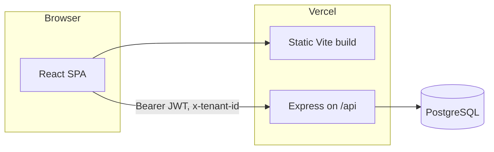

# MeshCore

MeshCore demonstrates a production-shaped split between HTTP routing, controllers, domain services, and infrastructure (PostgreSQL, structured logging, centralized errors). The UI is a signed-in workspace for tenant-scoped lists and read-only analytics cards, suitable as a portfolio anchor for full-stack SaaS work.

## Features

- Versioned HTTP API under `/api/v1` (duplicate mount `/v1` for compatibility)
- JWT auth, role checks, tenant header enforcement, rate limiting, Helmet
- Admin UI with session persistence, loading and error surfaces, and empty states
- PostgreSQL access via connection pool; migrations and seed scripts in `backend/scripts`
- Dockerfiles for backend and frontend; `docker-compose.yml` for local Postgres

## Tech stack

| Area | Stack |
|------|--------|
| API | Node.js 20+, TypeScript, Express, Zod, `pg`, Pino |
| UI | React 18, Vite, TypeScript, Axios |
| Data | PostgreSQL |
| Deploy | Vercel (static web + serverless API service), optional Docker |

## Prerequisites

- Node.js `>= 20`
- npm `>= 10`
- Docker and Docker Compose (optional, for local Postgres)
- Git

## Setup

1. `npm install`
2. Copy `backend/.env.example` to `backend/.env` and set secrets and database variables.
3. `docker compose up -d postgres` when using the bundled Compose service.
4. `npm run db:migrate --workspace backend`
5. `npm run db:seed --workspace backend`
6. `npm run dev` and `npm run dev:frontend` in separate terminals, or rely on your own process manager.

Demo login (after seed): email `admin@meshcore.local`, password `password123`, tenant `00000000-0000-0000-0000-000000000001`.

## Environment variables

Production and Preview on Vercel should continue to use the same variable names already configured for the live project:

| Variable | Purpose |
|----------|---------|
| `NODE_ENV` | `production` in prod |
| `DATABASE_URL` | Primary Postgres connection string |
| `JWT_SECRET` | Signing secret for access tokens |
| `JWT_EXPIRES_IN` | Optional TTL (default `1h`) |
| `PORT` | Local server port (default `4000`) |
| `VITE_API_BASE_URL` | Frontend API base; production builds default to `/api/v1` when unset |

Local-only split database variables (`DB_HOST`, `DB_PORT`, `DB_NAME`, `DB_USER`, `DB_PASSWORD`) remain supported when `DATABASE_URL` is not set.

## Goal

Ship a credible reference implementation: clear module boundaries, predictable API errors, and an admin UI that behaves well under load and failure, without unnecessary abstraction layers.

## Mermaid diagram

